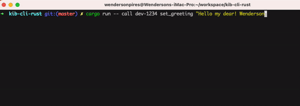

# Kibi Blockchain Experiment

This is a project I created to simulate the operation of a Blockchain.

## How to use

Download this repo, then, run `cargo run`;

## Contract App

I've built an experimental Contract that uses Kibi Blockchain to store / read data. To use it, follow these steps:

- 1 - Clone this repo and run `cargo run`;

- 2 - Go to [Kib GreetingContract](#) repo and clone it;

- 3 - Inside the `kibi-greeting-contract` repo/folder, run one of the commands below:

Persisting a `greeting`:

```sh
# dev-1234 = the contract id
# set_greeting = is a contract's method
# "Hello from Wendz!" = is the string value to be stored on chain under the contract
cargo run -- call dev-1234 set_greeting "Hello from Wendz!"
```

Viewing the current `greeting`:

```sh
# dev-1234 = the contract id
# greeting = is a contract's field
cargo run -- view dev-1234 greeting
```

<p align="left">
  
</p>

## Create Account

- 1 - Run `cargo run`.

- 2 - Execute the command bellow to create an account (change the account value as you wish):

```sh
curl --location 'http://localhost:8000/create_account' \
--header 'Content-Type: application/json' \
--data '{
    "account": "wendersonpires"
}'
```

- 2 - Execute the command bellow to get the current chain data:

```sh
curl --location 'http://localhost:8000/chain'
```

You can navigate over the **REST Api** to get to know more.

<details>
  <summary>REST Api</summary>
  
### health check

**URI:** http://localhost:8000 </br>
**METHOD:** GET </br>

### new transaction

**URI:** http://localhost:8000/new_transaction </br>
**METHOD:** POST </br>
**BODY:**

```json
{
  "from": "public key? user name?",
  "to": "<optional for now>",
  "content": "json content"
}
```

O `body` que é o `dado` de cada transação é salvo na chain em forma de String (stringified JSON).

### create account

**URI:** http://localhost:8000/create_account </br>
**METHOD:** POST </br>
**BODY:**
**AUTO-MINE:** true

```json
{
  "account": "wendersonpires.kib"
}
```

Esta rota faz executa o `mine` automaticamente pois deve-se assegurar que uma conta igual não seja registrada novamente.

### mine

**URI:** http://localhost:8000/mine </br>
**METHOD:** GET </br>

### chain

**URI:** http://localhost:8000/chain </br>
**METHOD:** GET </br>

Durante o processo de buscar os blocos, todos os dados (`transactions` / `dado`) é convertido para JSON novamente para ser exibido ao cliente final.

### contract transaction

**URI:** http://localhost:8000/contract_transaction </br>
**METHOD:** POST </br>
**BODY:**

```json
{
  "tx_type": "CONTRACT",
  "contract_id": "dev-1234",
  "data": "stringified json content"
}
```

Rota usada para guardar novos dados em um contrato específico.

### contract_payload

**URI:** http://localhost:8000/contract_payload/<contract_id> </br>
**METHOD:** GET </br>

Rota usada para buscar os dados mais atuais de um contrato.

### contract_payload_json

**URI:** http://localhost:8000/contract_payload_json/<contract_id> </br>
**METHOD:** GET </br>

Rota usada para buscar os dados mais atuais de um contrato e retorna-los no formato JSON.

</details>
